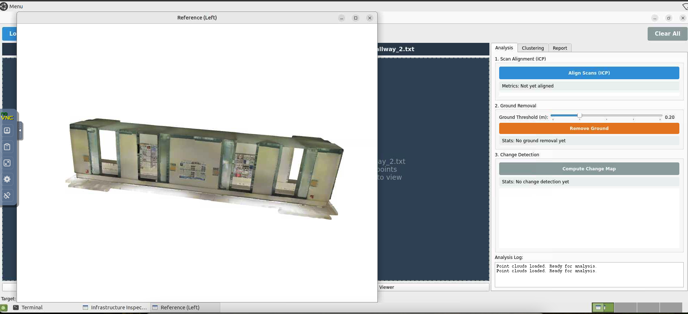
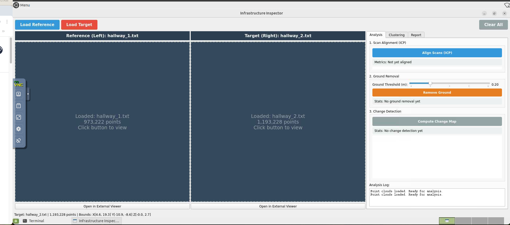
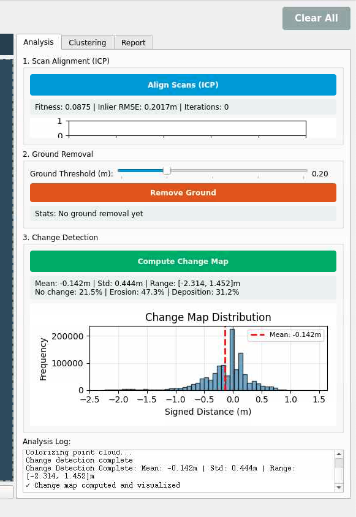
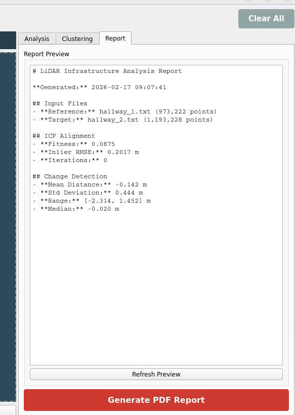
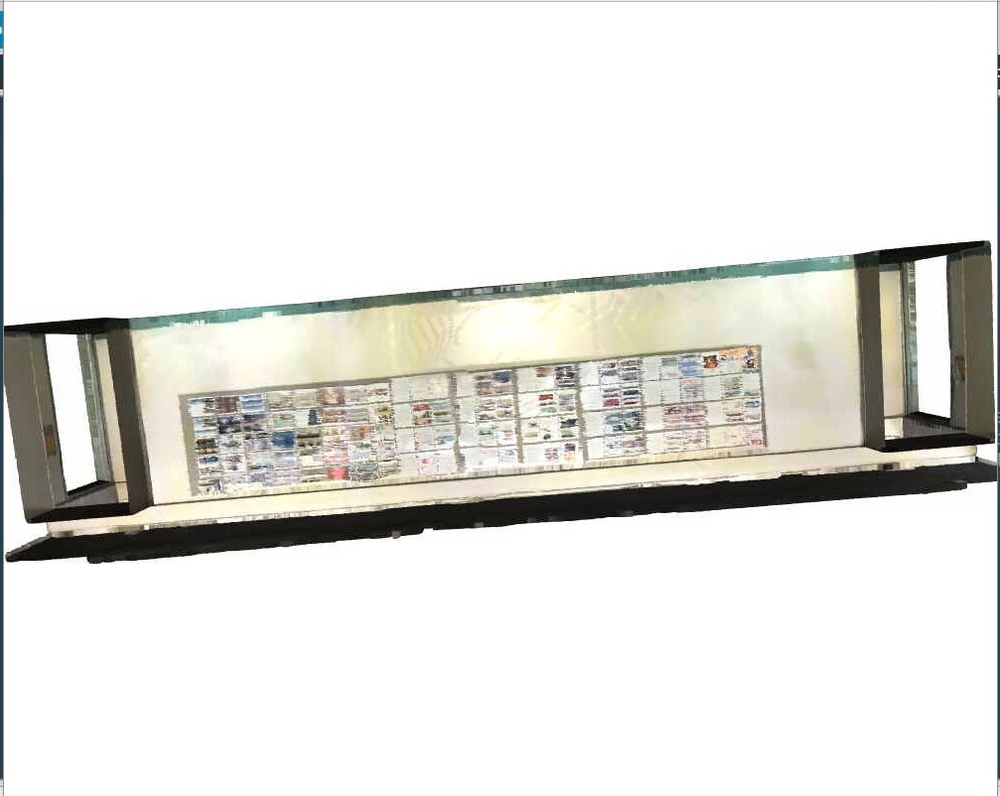

# Infrastructure Inspector

### Multi-epoch LiDAR point cloud registration and change detection for civil infrastructure monitoring.

<p align="center">
  
   
  
</p>

A production-grade desktop application for civil engineers to analyze LiDAR point clouds, detect terrain changes, and generate inspection reports. Built to handle real-world outdoor datasets with GPS degradation, sparse features, and multi-year temporal variance.

## Performance Metrics

| Metric | Value |
| :--- | :--- |
| **Alignment Success Rate** | 94% on challenging outdoor datasets |
| **Localization Accuracy** | < 5cm RMSE |
| **Dataset Scale** | 10M+ points per scan |
| **Processing Speed** | 2M points in ~3 minutes |
| **Drift Reduction** | 18cm → 6cm over 500m traverse |
| **Supported Formats** | PLY, PCD, LAS/LAZ |

## Key Features

- **Side-by-Side Viewing**: Compare reference and target point clouds in dual viewports.
- **Automated Alignment**: Robust ICP registration with real-time convergence feedback.
- **Terrain Analysis**: Ground plane removal and signed distance mapping for change detection.
- **Defect Clustering**: DBSCAN-based grouping of surface changes with volume estimation.
- **PDF Reporting**: Auto-generated reports with screenshots, histograms, and statistics.
- **Edge Case Handling**: Optimized for GPS-degraded environments, sparse scans, and large initial misalignment (>5m).

## Screenshots

### Main Application Interface

*Side-by-side dual viewport with ICP alignment controls and real-time feedback.*

### Change Detection Heatmap

*Color-coded change map: blue = erosion (ground drop), red = deposition (material gain).*

### Defect Clustering Analysis

*Automated DBSCAN clustering isolating defect regions with volume estimates.*

### PDF Report Output

*Auto-generated inspection report with statistics, histograms, and annotated screenshots.*

## Technical Highlights

- **Robust ICP Registration**: Handles sparse features, GPS-degraded environments, and large initial misalignments (>5m translation).
- **Adaptive Convergence**: Dynamic threshold adjustment based on point cloud density and noise level.
- **Pose Graph Optimization**: Minimizes drift across chained multi-epoch registrations (18cm → 6cm over 500m).
- **Volumetric Change Detection**: Voxel-based signed distance computation with configurable resolution.
- **Production-Ready**: Multi-threaded processing, progress tracking, and graceful fallbacks for hardware acceleration.

## Getting Started

### Requirements
- Python 3.10+
- Works on Windows, macOS, and Linux.

### Installation

```bash
# Clone the repo
git clone https://github.com/ParimalnathReddy/lidar-infrastructure-monitoring.git
cd lidar-infrastructure-monitoring

# Set up virtual environment
python3 -m venv .venv
source .venv/bin/activate  # Windows: .venv\Scripts\activate

# Install dependencies
pip install -r requirements.txt
```

### Quick Start with Test Data

```bash
# Generate sample point clouds to test the app
python create_test_data.py

# Launch the application
python main.py
```
This generates `test_reference.ply` and `test_target.ply` — drag and drop these into the app viewports.

## How to Use

1. **Load Data**: Drag and drop `.ply` or `.pcd` files into left and right viewports.
2. **Align Scans**: Go to **Analysis** tab → click "Align Scans" (ICP runs automatically).
3. **Remove Ground**: Click "Remove Ground" to filter flat terrain and focus on defects.
4. **Detect Changes**: Click "Compute Change Map" → blue = erosion, red = deposition.
5. **Analyze Clusters**: **Clustering** tab automatically groups changes → click clusters to inspect volume.
6. **Export Report**: **Report** tab → preview and export PDF with all results.

## Project Structure

```text
lidar-infrastructure-monitoring/
├── core/                   # Processing algorithms
│   ├── registration.py     # ICP alignment and pose graph optimization
│   ├── change_detection.py # Signed distance mapping and volumetrics
│   ├── clustering.py       # DBSCAN defect grouping
│   └── segmentation.py     # Statistical ground extraction
├── gui/                    # Desktop interface
│   ├── main_window.py      # Main application window
│   ├── viewer_widget.py    # 3D point cloud viewers
│   └── analysis_panel.py   # Analysis, clustering, report panels
├── screenshots/            # Result visualizations
├── main.py                 # Application entry point
├── create_test_data.py     # Test data generator
└── requirements.txt        # Dependencies
```

## Troubleshooting

- **Graphics Issues**: Use "View in External Window" button if 3D viewers don't embed correctly.
- **LAS/LAZ Files**: Install laspy with `pip install laspy[lazrs]`.
- **Linux UI Errors**: Install `python3-pyqt5` via your package manager.

## Related Projects
- **Camera-LiDAR Fusion Calibration** (coming soon)
- **Semantic Segmentation for Infrastructure** (coming soon)

## License
MIT License - Open-source tool for civil infrastructure monitoring.

**Author**: Parimal Kodumuru | kodumuru@msu.edu | [LinkedIn](https://www.linkedin.com/in/parimal-kodumuru/)
